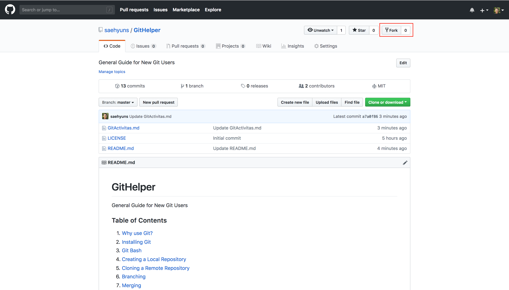
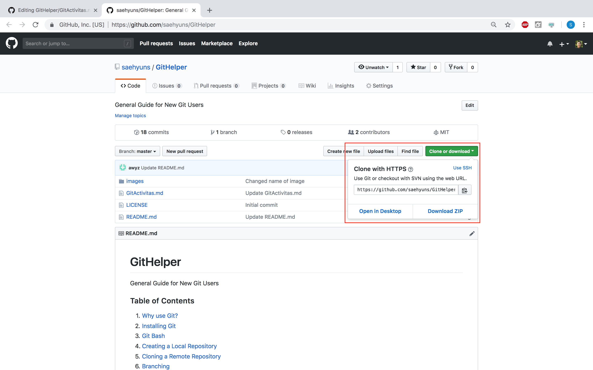
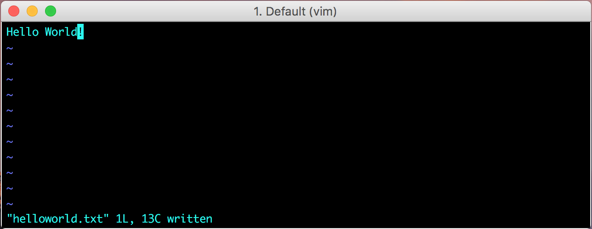

# Git Activitas Pre-Req

## Install Git

## Fork GitHelper



Go to the [GitHelper Repository](https://github.com/saehyuns/GitHelper) and fork the repository to your own account so that you have a copy of it yourself that you can modify without changing my GitHelper in my repository!

## Clone GitHelper to Local



Go to the forked repository and clone it to your local computer!

# Git Activitas 1

## Create a HelloWorld Text File



Go to the repository on your local computer and create a text file called helloworld.txt in the GitActivitas1 directory!
You can choose to do this via the user interface or if you want to be cool, you can create it in the command line.
In my case..

```
cd Documents/GitHub/GitHelper/GitActivitas1
vim helloworld.txt
press 'i'
type 'Hello World!'
Press Esc and Shift + ZZ OR :w and :q
```

## Add, Commit, and Push Changes to the Remote Repository

Now that you're done, you can now add, commit, and push the changes you've made to the remote repository!

```
git status
git add .
git commit -m "I created a helloworld.txt file!"
git push
```

# Git Activitas 2

## Split into groups!


Split into a group of four, each of you will be implementing a basic function of a calculator!

## Each person in the group branch and work on a specific function of a calculator

Go to the GitHelper repository and create your own branch:

```
cd Documents/GitHub/GitHelper/GitActivitas2
git status                        // View the status of the repository
git branch                        // See all the current branches
git checkout -b < Branch Name >   // Create a branch named < Branch Name > and checkout the repository
Apply what you learned from before!
```

## Everyone merge and push to master!
Once you are all done doing your parts it's time to put it all together and create a final product! Go back to master and merge your branch!

```
git checkout master
git merge < Your Branch >
git push
```
